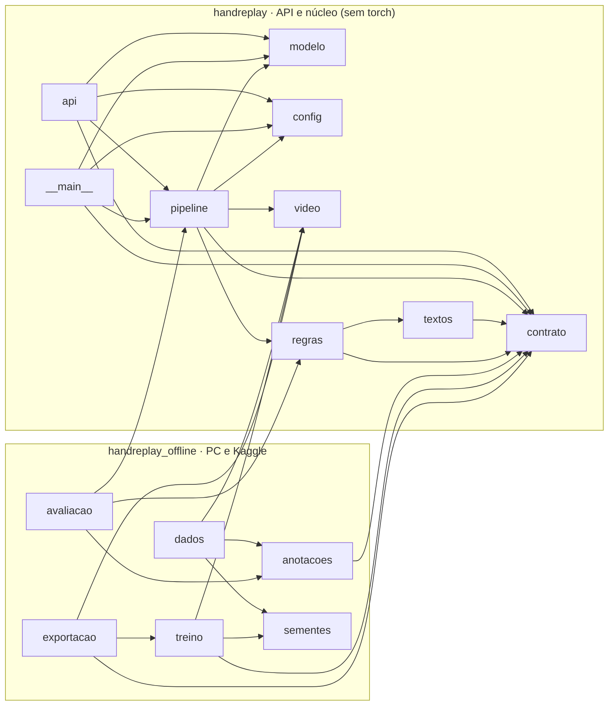

# HandReplay — diagnóstico e proposta de arquitetura

> **Status:** revisão 2 (custo zero), **aprovada em 24/09/2026**, incluindo A1, A2 e A3; `GET /saude` só é chamado ao abrir o painel "Enviar vídeo" · **Data:** 24/09/2026
> **Base:** *HandReplay — Plano de trabalho*, versão final de 22/09/2026 (16 páginas)
>
> **Histórico:**
> - **Revisão 1 (23/09):** proposta inicial, com o app inteiro num Space Docker.
> - **Revisão 2 (24/09):** restrição de custo zero. O Space Docker sai, e o projeto passa a ter duas partes independentes: o front estático, que funciona sem back-end, e a API num container portátil. A P10 e a P14 foram aprovadas, e a licença passa a ser MIT.
>
> A estrutura marcada com ● e ○ na seção 8 foi criada depois da aprovação.

## Sumário

1. [Resumo](#1-resumo)
2. [Estado atual do repositório](#2-estado-atual-do-repositório)
3. [Decisões já tomadas](#3-decisões-já-tomadas)
4. [Arquitetura escolhida](#4-arquitetura-escolhida)
5. [Alternativas descartadas](#5-alternativas-descartadas)
6. [Grafo de dependências](#6-grafo-de-dependências)
7. [Contrato do JSON de resultado (v1.0.0)](#7-contrato-do-json-de-resultado-v100)
8. [Árvore de diretórios final](#8-árvore-de-diretórios-final)
9. [Dependências, qualidade e reprodutibilidade](#9-dependências-qualidade-e-reprodutibilidade)
10. [O que será criado após a aprovação](#10-o-que-será-criado-após-a-aprovação)
11. [Pendências](#11-pendências)
12. [Fontes consultadas](#12-fontes-consultadas)

---

## 1. Resumo

- Hoje o repositório tem só o PDF do plano e estes documentos. Não há git, código nem configuração.
- A proposta é um **monólito pequeno com núcleo funcional e casca fina**, separado em três partes:
  - `src/handreplay/`: tudo que roda na API em CPU, mais o núcleo que o treino reaproveita. Nunca importa torch.
  - `src/handreplay_offline/`: o que roda fora da API, ou seja, a preparação dos dados no PC, o treino e a exportação no Kaggle e as métricas. Nunca entra na imagem Docker.
  - `app/`: o front-end estático (HTML, CSS e JS sem etapa de build).
- **Duas publicações independentes, as duas sem custo** ([ADR 0005](../adr/0005-hospedagem-custo-zero.md)):
  - O front vai para o GitHub Pages com os 3 exemplos já calculados. Sem a API, o site continua funcionando em "modo só exemplos".
  - A API vai para um container portátil, sem nada exclusivo de um provedor. O provedor recomendado é o Azure Container Apps, pelo Azure for Students.
  - O front lê a URL da API em `app/js/config.js`, e a API só aceita requisições CORS vindas da origem do front.
- O plano exige duas fronteiras: torch fora da produção, e o mesmo pré-processamento e as mesmas regras no treino e no app. O import-linter confere as duas a cada execução.
- O JSON de resultado é o **contrato v1.0.0**, escrito em Pydantic e versionado em `versao.contrato`. As quatro adições feitas por causa dos mockups já foram aprovadas (P14).
- Os três pontos novos desta revisão (A1, A2 e A3, seção 3.1) foram aprovados.

---

## 2. Estado atual do repositório

| Item | Situação |
|---|---|
| Conteúdo | `HandReplay — Plano de trabalho.pdf` (940 KB, 16 páginas, com os dois mockups embutidos), este documento e o ADR 0005. |
| Git | A pasta não é um repositório git e não tem remoto. |
| Código, testes, configuração | Nenhum. |
| Localização | `C:\Users\thale\OneDrive\Área de Trabalho\HandReplay`, **ainda dentro da pasta sincronizada pelo OneDrive**. |
| Ferramentas na máquina | Python 3.12.6, pip 26.2.1, git 2.53, ffmpeg/ffprobe 9.0 (build gyan.dev), Docker 29.6.2. O disco C: tem 179 GB livres. |
| Pacotes Python | numpy 2.3.3, pandas 2.3.2, pydantic 2.13.4, fastapi 0.141.1, onnxruntime 1.28.0, torch 2.14.0, pytest 9.1.1 e matplotlib 3.10.6, instalados no Python do sistema, sem ambiente virtual. |

### 2.1 Problemas encontrados

1. **OneDrive.** A Fase 1 prevê de 30 a 50 GB de vídeos e frames em `data/`. Dentro do OneDrive, tudo isso seria enviado para a nuvem, gastando cota e banda. Além disso, o git costuma ter problemas em pastas sincronizadas, com arquivos bloqueados e cópias em conflito. O caminho também tem espaço e acento (`Área de Trabalho`).
   - **Proposta:** a pasta de dados passa a ser configurável (`HANDREPLAY_DADOS`, seção 9.4).
   - **Pendente P9:** mover o repositório é decisão sua. Enquanto a pasta estiver no OneDrive, não rodo `git init`.
2. **O PDF tem dados pessoais de terceiros**, os e-mails de pesquisadores na tabela de pedidos. **Aprovado (P10):** o PDF fica fora do git, e só as imagens dos mockups vão para `docs/referencia/`.
3. **Pacotes globais.** **Proposta:** um `.venv` por projeto, ignorado pelo git.

### 2.2 Diferenças entre o pedido e o plano

| # | Pedido | Plano (versão final) | Encaminhamento |
|---|---|---|---|
| D1 | API com `GET /card/{id}` e card gerado no servidor | Decisão 6: card no canvas do navegador. Fase 4: "Não há outra rota, e nada é guardado entre requisições" | Você escolheu seguir o plano (seção 3). |
| D2 | Etapa offline "no Colab/Kaggle", incluindo a preparação dos dados | R3 fixa o Kaggle. A decisão 15 põe a preparação no PC | Sigo o plano. Os notebooks também rodariam no Colab. |
| D3 | Custo zero, só com serviços gratuitos ou benefícios de estudante (revisão 2) | Hospedagem "de graça" no Space Docker, que hoje exige plano pago para criar | O Space Docker sai: front no GitHub Pages e API num container portátil (seção 3, ADR 0005). |
| D4 | O checklist do plano cita `requirements.txt` | O pedido quer dependências separadas para treino e produção | `requirements.txt` passa a ser o arquivo da produção, e treino e desenvolvimento ganham arquivos próprios (seção 9.1). |
| D5 | A API fica num endereço separado do front (revisão 2) | Fase 4: FastAPI "com os arquivos estáticos do front" | A API deixa de servir o front. O front fala com ela por CORS (seção 4.5). |

---

## 3. Decisões já tomadas

| Tema | Decisão | Efeito na estrutura |
|---|---|---|
| Card | **Gerado no navegador** (decisão 6 do plano; resposta de 23/09). | Sem Pillow, sem rota nem módulo de card no servidor, sem estado. O card fica em `app/js/card.js`. |
| Hospedagem (revisão 2, custo zero) | **Duas partes independentes.** O front e os 3 exemplos vão para o **GitHub Pages**; a API vai para um **container portátil**, e o provedor recomendado é o **Azure Container Apps pelo Azure for Students** ([ADR 0005](../adr/0005-hospedagem-custo-zero.md)). O Heroku sai porque exige cartão, e o Space Docker sai porque exige plano pago para criar. | Dockerfile genérico (porta em `PORT`, usuário sem root, nenhum cabeçalho do Spaces). CORS feito na aplicação, não no provedor. URL da API em `app/js/config.js`. Imagem pública no ghcr.io. |
| Pesos e vídeos de exemplo | **Em repositórios do HF Hub**, usados só como armazenamento. O `.onnx` é baixado no build da imagem da API com o commit fixado e checksum. Os 3 vídeos são baixados no deploy do Pages. | Nenhum binário em repositório de código. |
| PDF do plano (P10) | **Aprovado:** fica fora do git; as imagens dos mockups vão para `docs/referencia/`. | Uma entrada no `.gitignore`. |
| Adições ao contrato (P14) | **Aprovadas** (seção 7.3). | Nenhum. |
| Licença do código (antiga P8) | **MIT.** | Arquivo `LICENSE`. |
| ADRs e qualidade | O ADR 0007 é fundido ao 0002. O ADR 0008 vira a seção "Qualidade" do README. Entra `.pre-commit-config.yaml` com ruff e nbstripout. | Seis ADRs e um arquivo do pre-commit. |

### 3.1 Pontos novos desta revisão (aprovados em 24/09/2026)

| # | Proposta | Por que é necessária |
|---|---|---|
| A1 | **`GET /saude`**, uma rota a mais além de `POST /analisar`. Devolve `{"status": "ok", "versao": {…}}` e não guarda nada. O front **só chama essa rota quando a pessoa abre o painel "Enviar vídeo"**, nunca ao carregar a página. | Com a API escalando a zero (ADR 0005), o front precisa saber se ela está no ar antes de a pessoa enviar 200 MB. A chamada também acorda o container enquanto a pessoa escolhe o arquivo. Quem só vê os exemplos não acorda o container nem gasta a cota. Aprovado como exceção ao "Não há outra rota" do plano. |
| A2 | **O JSON dos 3 exemplos fica versionado em `app/exemplos/*.json`** (Fase 7). É gerado no PC com `python -m handreplay`, e um teste confere que ele segue o contrato. | O front precisa abrir com o primeiro exemplo carregado mesmo sem API. O JSON é um resultado derivado, sem pixels dos vídeos de terceiros; os vídeos em si continuam fora do git. |
| A3 | **Um workflow do GitHub Actions só para publicar o Pages** (`.github/workflows/pages.yml`, Fase 5). | Publicar a partir de uma branch só aceita a raiz ou `/docs`, não `app/`. Além disso, os vídeos precisam ser baixados do HF Hub na hora do deploy. A observação 16c adiou apenas o CI de testes, e este workflow não roda testes. |

---

## 4. Arquitetura escolhida

### 4.1 Onde cada parte roda

| Ambiente | O que roda | Código | Custo |
|---|---|---|---|
| PC local | Fases 0 e 1 (download, anotações, votação, frames, índice), as métricas do produto (Fase 3), o JSON dos exemplos (Fase 7) e o build da imagem da API | `handreplay_offline` (`anotacoes`, `dados`, `avaliacao`) + núcleo do `handreplay` | zero |
| Kaggle (GPU) | Fase 2: treino, calibração, exportação ONNX e métricas do modelo | `handreplay_offline` (`treino`, `exportacao`, `avaliacao`) + núcleo do `handreplay` | zero (cota gratuita do Kaggle) |
| HF Hub | Guarda o `.onnx` e os 3 vídeos de exemplo, com commits fixados | — | zero (repositórios públicos) |
| GitHub | Código; GitHub Pages para `app/` e os exemplos; ghcr.io para a imagem pública da API | `app/` | zero em repositório público ([ADR 0005](../adr/0005-hospedagem-custo-zero.md)) |
| Provedor de container (recomendado: Azure Container Apps) | `POST /analisar` e `GET /saude` | `handreplay` | zero dentro da cota mensal; acima dela, o crédito de estudante (ADR 0005) |
| Navegador | Tela Analisar, HUD, card e o "modo só exemplos" | `app/` | — |

Os artefatos passam de um ambiente para o outro nesta ordem:

```
Zenodo (PSKUS, METC)
  └─► PC: anotações + frames 5 fps + índice ──► Kaggle Dataset privado
        └─► Kaggle: treino + calibração ──► handreplay.onnx (temperatura e metadados embutidos)
              └─► repositório de modelo no HF Hub (commit X)
                    └─► PC: docker build (ADD com checksum) ──► imagem pública no ghcr.io ──► provedor de container

PSKUS, local de teste ─► 3 vídeos ─► repositório de dataset no HF Hub (commit Y)
                              └─► PC: python -m handreplay ─► app/exemplos/*.json (versionados, A2)

app/ + app/exemplos/*.json + os 3 vídeos (baixados no deploy, A3) ─► GitHub Pages
```

**Os dois modos do front:**

| Modo | Quando | O que funciona |
|---|---|---|
| Completo | A URL em `app/js/config.js` está preenchida e `GET /saude` responde quando a pessoa abre o painel "Enviar vídeo" | Tudo: envio de vídeo, análise, replay, card e relatório |
| Só exemplos | A URL está vazia, ou a API não responde a tempo depois que o painel foi aberto | Os 3 exemplos com replay, HUD, mapa, passos, card e "Baixar relatório". O painel "Enviar vídeo" explica que a análise está indisponível no momento. |

A página abre sempre com os exemplos e não faz nenhuma chamada à API. Só abrir o painel "Enviar vídeo" dispara `GET /saude`.

### 4.2 Estilo: núcleo funcional e casca fina

- **Núcleo puro**, sem I/O e sem estado: `contrato`, `textos` e `regras`. Recebe números e devolve números ou objetos. Aqui ficam todas as regras do plano. Os cinco testes fixos da Fase 3 e as métricas do produto usam esse núcleo direto, sem vídeo e sem modelo.
- **Casca de I/O:** `video` chama ffprobe e ffmpeg por subprocess, e `modelo` guarda a sessão do ONNX Runtime. São módulos simples, sem interfaces abstratas.
- **Orquestração:** `pipeline.analisar(video, modelo) -> dict`.
- **Pontos de entrada:** `api` (FastAPI) e `__main__` (linha de comando).
- O modelo entra em `analisar` como parâmetro. Isso dá o que uma "porta" da arquitetura hexagonal daria, que é testar sem ONNX e carregar o modelo uma vez por processo, sem criar uma interface.

### 4.3 Cada peça e o problema do plano que ela resolve

| Peça | Problema concreto do plano |
|---|---|
| Dois pacotes (`handreplay` e `handreplay_offline`) | O torch não pode entrar na imagem, mas treino e app precisam do mesmo comando ffmpeg, recorte e normalização (Fase 1, R7, observação 14) e das mesmas regras (métricas do produto, Fase 3). |
| `contrato.py` (Pydantic) | "O JSON é o contrato entre back-end e front-end" (Fase 3); "JSON validado pelo Pydantic" (Fase 4); observação 16a. Agora front e API são publicados em momentos diferentes, e o contrato versionado é o que os mantém compatíveis. |
| `regras.py`, sem I/O | Os cinco testes fixos (Fase 3, observação 16b) e a aplicação das mesmas regras às anotações humanas. |
| `textos.py` | Tabelas de nomes, instruções e frases (Fases 3, 5 e 6, R5). Como "o texto é escrito na semana 8", revisar o texto não deve exigir mexer em lógica testada. |
| `video.py` | O mesmo ffmpeg no treino e no app (Fase 1, observação 14), os limites conferidos com ffprobe (Fase 4) e o lado menor de 224 com recorte central (R7). |
| `modelo.py` | Inferência em CPU com ONNX Runtime. A versão e a ordem das classes são lidas dos metadados do `.onnx`. |
| `pipeline.py` | A função `analisar(video) -> dict` da Fase 3. |
| `__main__.py` | "Um comando gera o JSON de um vídeo de 60 s" (Fase 3). O mesmo comando gera o JSON dos exemplos (Fase 7, A2). |
| `api.py` | `POST /analisar` com o arquivo temporário apagado com ou sem erro e as mensagens de erro (Fase 4); `GET /saude` (A1); CORS restrito à origem do front (revisão 2). |
| `config.py` | O limite de 200 MB pode mudar depois do teste no provedor (Fase 4, R1). Origens do CORS, threads e caminhos mudam conforme o ambiente, e nenhum secret fica no código. |
| `anotacoes.py` | Os formatos do PSKUS e do METC, a votação, o código 7 como "outro" e a margem de 0,5 s (Fases 0 e 1, R10). |
| `dados.py` | Frames a 5 fps, divisão por local com semente, índice e gráfico das classes (Fase 1). |
| `sementes.py` | "Sementes fixas" (checklist final) e divisão 85/15 reproduzível (Fase 1). |
| `treino.py` e `exportacao.py` | Fine-tuning, perda ponderada, augmentation, temperature scaling, ONNX com a temperatura embutida e paridade em 100 frames (Fase 2). |
| `avaliacao.py` | Métricas do modelo (Fase 2) e do produto (Fase 3). |
| `app/` sem framework | A stack pede HTML, CSS e JS para uma única tela. Sem framework, não há Node nem bundler, e o Pages publica a pasta como ela está. |
| `app/js/config.js` | Front e API ficam em endereços diferentes. A URL da API muda sem mexer no resto do código, e vazia liga o "modo só exemplos". |
| `app/exemplos/*.json` | "Ao abrir a página, o primeiro exemplo já aparece carregado" (Fase 5), mesmo sem API (A2). |
| `app/js/maos.js` | Um único desenho das mãos para a tela e para o card (Fase 6). |
| import-linter | Confere as duas fronteiras e a ausência de ciclos a cada execução. |

### 4.4 O que fica de fora, de propósito

- Interfaces, ABCs ou `Protocol` para vídeo e modelo; repositórios; camada de serviço; contêiner de injeção de dependência.
- Banco de dados, cache e fila de tarefas: nada é guardado, e a análise cabe na própria requisição.
- **Qualquer coisa exclusiva de um provedor dentro do repositório:** nenhum SDK do Azure, nenhum arquivo de infraestrutura como código (Bicep, ARM, Terraform) e nenhum cabeçalho do Spaces. Os comandos de publicação ficam documentados no README (Fase 4).
- `pydantic-settings`, framework ou bundler no front, e Node.
- JSON Schema exportado e CI de testes (observação 16c, adiada) e model card no Hub (observação 17, adiada).
- Inferência no navegador (observação 21, adiada). Sem a API, o front mostra só os exemplos; ele não tenta analisar sozinho.
- Qualquer código para avaliar a qualidade do movimento, para webcam ou para as abas "Por dentro da IA" e "Dados reais".

### 4.5 API: comportamentos que a estrutura precisa suportar

- **Modelo carregado uma vez**, no `lifespan` do FastAPI. Usa o `CPUExecutionProvider`, e `intra_op_num_threads` vem de `HANDREPLAY_THREADS`. O número de CPUs visível dentro de um container nem sempre é a cota contratada, por isso o valor é explícito.
- **A rota `POST /analisar` é declarada com `def`**, então o FastAPI a roda num threadpool. O provedor de CPU do ONNX Runtime aceita chamadas concorrentes de `run` na mesma sessão ([issue #114](https://github.com/microsoft/onnxruntime/issues/114)). Se vale limitar a uma análise por vez é **pendente P11**.
- **`GET /saude` (A1)** devolve o status e a versão sem tocar no modelo nem em arquivos.
- **CORS feito na própria aplicação:** `CORSMiddleware` do FastAPI com `allow_origins` igual à lista em `HANDREPLAY_ORIGENS` (só a origem do front, por exemplo `https://<usuario>.github.io`), métodos `GET` e `POST`, sem credenciais. Configurar o CORS no ingress do provedor também seria possível, mas prenderia a configuração ao Azure.
- **O vídeo nunca é armazenado.**
  - O upload é copiado em blocos para um `NamedTemporaryFile` de nome aleatório, contando os bytes para detectar `arquivo_grande`, e é apagado num `finally`.
  - O arquivo precisa de nome porque o MP4 de celular costuma ter o índice (`moov`) no fim, e o ffmpeg não consegue ler isso por pipe.
  - Nenhum log grava o nome, o conteúdo ou os frames do vídeo.
- **Limites do provedor.** No Azure Container Apps, o tempo máximo de uma requisição é de 240 s, o que cobre a meta de 30 s com folga. O limite de upload não é documentado (**pendente P2**, medir na semana 5).
- **ffprobe e ffmpeg** são chamados com uma lista de argumentos (sem shell) e com timeout; só entram arquivos mp4/mov ou webm.
- **A API não serve arquivos estáticos.** O front é publicado à parte (D5).

### 4.6 Front-end

- **Módulos ES nativos, sem build:**
  - `config.js`: a URL da API. Vazia, liga o modo só exemplos.
  - `principal.js`: estados da tela, carregamento do exemplo, `GET /saude` ao abrir o painel "Enviar vídeo" e envio do vídeo por `XMLHttpRequest`, porque é ele que informa o progresso do upload.
  - `resultado.js`: nota, passos, mapa e linha do tempo.
  - `replay.js`: HUD sincronizado pelo `timeupdate`, velocidade e botão "Sobreposição".
  - `maos.js`: a geometria das mãos, desenhada em SVG na tela e com `Path2D` no card.
  - `card.js`: o canvas de 1080×1350 e o download em PNG.
- **A API só é chamada quando a pessoa demonstra que vai enviar um vídeo.**
  - Ao carregar, a página mostra o primeiro exemplo usando só o Pages, sem nenhuma requisição à API.
  - Ao abrir o painel "Enviar vídeo", o front chama `GET /saude` uma vez. Isso acorda o container enquanto a pessoa lê as orientações e escolhe o arquivo.
  - Quem só vê os exemplos não acorda o container nem consome a cota do provedor (ADR 0005).
- **Um estado a mais no painel: "servidor acordando".** Aparece enquanto `GET /saude` não responde. O Container Apps escala a zero, e a primeira chamada pode demorar, então o front avisa a pessoa e tenta de novo.
  - O seletor de arquivo só é liberado depois que a API responde.
  - Se a API não responder a tempo, o painel mostra que a análise está indisponível e mantém os exemplos. O tempo de espera é a P13.
- **O front não calcula nenhuma regra.** Ele só lê o JSON e formata.
- **Conferência de versão.** O front confere o major de `versao.contrato` nas respostas da API e nos JSON dos exemplos. Como front e API agora são publicados separados, essa conferência é o que impede um front antigo de ler um JSON novo sem perceber.
- **Fontes e cores.** As fontes vêm do Google Fonts, e o card espera `document.fonts.load` antes de desenhar. As cores do sistema visual viram variáveis CSS.

---

## 5. Alternativas descartadas

### 5.1 Arquitetura em camadas (apresentação → serviço → domínio → persistência)

- **Por que não:**
  - Não há persistência, então a camada de repositório ficaria vazia.
  - A camada de serviço só repassaria a chamada para `analisar`.
  - Camadas dividem o sistema na horizontal, mas as fronteiras reais do plano são verticais: offline × API e front × API.
- **O que aproveitamos:** a direção das dependências (`api → pipeline → regras → contrato`), verificada pelo import-linter.

### 5.2 Hexagonal (portas e adaptadores)

- **Por que não:** cada porta teria um único adaptador durante toda a v1. O que a hexagonal oferece, testar o núcleo isolado, já vem de manter `regras` sem I/O e de passar o modelo como parâmetro.
- **Nota sobre a revisão 2:** trocar de provedor não pede portas no código. O que garante a troca é o container portátil, e o código Python não sabe onde está rodando.

### 5.3 Monólito modular (módulos por contexto, cada um com API pública e dados próprios)

- **Por que não:** existe um único contexto de negócio, com um desenvolvedor e cerca de 72 horas.
- **O que aproveitamos:** a única fronteira de módulo que importa, offline × API, vira dois pacotes com regra de importação verificada.

### 5.4 Hospedagem descartada na revisão 2 (detalhes no [ADR 0005](../adr/0005-hospedagem-custo-zero.md))

| Alternativa | Motivo |
|---|---|
| Space Docker (inclusive numa conta antiga do HF) | A documentação atual diz que "creating a new Space that runs on compute (Gradio or Docker) requires a paid plan" e não prevê exceção para contas antigas. |
| Heroku pelo Student Pack | Exige "a valid credit or debit card on file". Além disso, a resposta tem de sair em até 30 s depois do fim do upload, e a memória é de 0,5 GB. |
| Front servido pela própria API (como na revisão 1) | Com a API dormindo ou fora do ar, a página inteira sumiria; o pedido exige um front que funcione sem back-end. |
| Space estático do HF para o front | Também é gratuito, mas exige um segundo repositório com cabeçalho YAML próprio. O Pages publica do mesmo repositório do código. Fica como plano B. |
| Vídeos de exemplo tocados direto de uma URL do HF Hub | Seria uma origem cruzada, com comportamento de busca no vídeo não verificado. Baixar os vídeos no deploy do Pages deixa tudo na mesma origem. |
| `preload_from_hub` | Recurso exclusivo do Spaces. |
| Inferência no navegador para cobrir a falta da API | Adiada pela observação 21 e não antecipada. |

### 5.5 Outras alternativas descartadas

- **Serviço de inferência separado ou microsserviços:** um container basta, e não há escala a atender.
- **Fila assíncrona com polling:** exigiria guardar estado. O limite de 240 s do provedor recomendado comporta a análise síncrona.
- **Card no servidor (Pillow e `GET /card/{id}`):** descartado pelo plano (observação 6) e por você.

---

## 6. Grafo de dependências

### 6.1 Módulos Python

Nesta tabela, "A importa B" quer dizer que A depende de B.

| Módulo | Importa (interno) | Importa (externo) |
|---|---|---|
| `handreplay.contrato` | — | pydantic |
| `handreplay.textos` | contrato | — |
| `handreplay.regras` | contrato, textos | numpy |
| `handreplay.video` | — | numpy, subprocess (ffmpeg/ffprobe) |
| `handreplay.modelo` | — | numpy, onnxruntime |
| `handreplay.config` | — | os |
| `handreplay.pipeline` | config, contrato, modelo, regras, video | — |
| `handreplay.__main__` | config, contrato, modelo, pipeline | argparse |
| `handreplay.api` | config, contrato, modelo, pipeline | fastapi (inclui `CORSMiddleware`) |
| `handreplay_offline.sementes` | — | random, numpy |
| `handreplay_offline.anotacoes` | `handreplay.contrato` | pandas |
| `handreplay_offline.dados` | anotacoes, sementes, `handreplay.video` | pandas, matplotlib |
| `handreplay_offline.treino` | sementes, `handreplay.contrato`, `handreplay.video` | torch, torchvision |
| `handreplay_offline.exportacao` | treino, `handreplay.contrato`, `handreplay.video` | torch, onnx, onnxscript, onnxruntime |
| `handreplay_offline.avaliacao` | anotacoes, `handreplay.pipeline`, `handreplay.regras` | numpy, pandas, scikit-learn |



### 6.2 Regras verificadas pelo import-linter

| # | Tipo | Regra | Por quê |
|---|---|---|---|
| 1 | `forbidden` | `handreplay` não importa `handreplay_offline` | A imagem da API não inclui o pacote offline. |
| 2 | `forbidden` | `handreplay` não importa torch, torchvision, onnx, onnxscript, pandas nem matplotlib | Nenhum desses pacotes está em `requirements.txt`. |
| 3 | `forbidden` | `handreplay_offline.sementes`, `anotacoes`, `dados` e `avaliacao` não importam torch nem torchvision | As Fases 0, 1 e 3 rodam no PC sem torch. |
| 4 | `layers` | Dentro de `handreplay`: `api \| __main__` → `pipeline` → `regras \| video \| modelo \| config` → `textos` → `contrato` | Mantém o núcleo puro e a direção das dependências. |
| 5 | `acyclic_siblings` | Nenhum ciclo entre os módulos de `handreplay` nem entre os de `handreplay_offline` | Verificação de dependências circulares. |

O import-linter confere cadeias indiretas. Por isso a semente do torch fica em `treino.py`, e não em `sementes.py`.

### 6.3 Front-end e a fronteira HTTP

```
principal.js ──► config.js
     ├────────► resultado.js ──► maos.js
     ├────────► replay.js
     └────────► card.js ───────► maos.js

GitHub Pages (origem do front) ──► index.html, css, js, exemplos/*.json, exemplos/*.mp4
navegador ── GET  {API_URL}/saude ─────────────────────────────► API   (CORS: só a origem do front)
navegador ── POST {API_URL}/analisar (multipart, campo "video") ─► API ──► JSON do contrato v1
```

---

## 7. Contrato do JSON de resultado (v1.0.0)

O contrato é definido em `src/handreplay/contrato.py`, com Pydantic v2 e `extra="forbid"`. A API usa esses mesmos modelos como `response_model`. O "Baixar relatório" do front baixa exatamente esse JSON.

### 7.1 Resposta de sucesso (HTTP 200)

| Campo | Tipo | Regras |
|---|---|---|
| `versao.contrato` | texto semver | `"1.0.0"`; constante em `contrato.py` |
| `versao.modelo` | texto | Lido dos metadados do `.onnx`, gravados na exportação |
| `versao.regras` | texto semver | Constante em `regras.py` |
| `duracao_s` | número ≥ 0 | Duração do vídeo segundo o ffprobe |
| `orientacao` | `"paisagem"` \| `"retrato"` | Já considera a rotação gravada no arquivo |
| `nota` | inteiro de 0 a 100 | `arredondar(100 × P × D)` |
| `faixa` | `"MUITO BEM"` \| `"QUASE LÁ"` \| `"VAMOS DE NOVO"` | 90–100, 60–89 e 0–59; conferida contra `nota` |
| `frase_tela` | texto | Regras da Fase 3; a linha de baixo ("38,0 s · OMS: 40–60 s") é montada pelo front |
| `frase_card.texto` | texto | Primeira regra aplicável da Fase 6 |
| `frase_card.destaque` | texto | Trecho de `texto` que aparece em coral |
| `passos` | lista com exatamente 6 itens | Em ordem, `numero` de 1 a 6 |
| `passos[].numero` | inteiro de 1 a 6 | |
| `passos[].nome` | texto | Nome completo, usado no HUD |
| `passos[].nome_curto` | texto | Nome curto, usado na lista e no card |
| `passos[].instrucao` | texto | Tabela da Fase 5 |
| `passos[].tempo_s` | número ≥ 0 | Soma dos trechos da classe |
| `passos[].status` | `"feito"` \| `"curto"` \| `"nao_detectado"` | Feito com 2 s ou mais; curto entre 0 e 2 s; não detectado com 0 s |
| `trechos` | lista | Ordenados, contíguos, de 0 até `duracao_s` |
| `trechos[].inicio_s`, `fim_s` | número ≥ 0 | `fim_s > inicio_s` |
| `trechos[].classe` | 1–6 \| `"outro"` \| `"incerto"` | Um trecho com confiança abaixo de 0,60 vira `"incerto"` |
| `trechos[].confianca` | número de 0 a 1 | Média da probabilidade calibrada da classe |
| `regioes` | objeto com exatamente 7 chaves | `palmas`, `dorso_maos`, `espacos_dedos`, `lado_palmar_dedos`, `dorso_dedos`, `polegares`, `pontas_dedos` |
| `regioes.*` | `"coberto"` \| `"parcial"` \| `"nao_coberto"` | Melhor status entre os passos que acendem a região. O punho fica de fora e é desenhado em cor neutra |
| `resumo.passos_completos` | inteiro de 0 a 6 | Igual ao número de passos com status `feito` |
| `resumo.passo_mais_longo` | `{numero, tempo_s}` | Sempre existe, porque sem nenhum passo feito a resposta é `sem_lavagem` |

**O Pydantic também confere estes invariantes:**

- Os 6 passos vêm em ordem.
- Os trechos são contíguos e cobrem de 0 a `duracao_s`, com tolerância de um frame (0,2 s).
- A `faixa` é coerente com a `nota`.
- `regioes` tem as 7 chaves.
- `passos_completos` bate com os status.
- O `tempo_s` de cada passo é igual à soma dos seus trechos, com tolerância de 0,05 s.

### 7.2 Resposta de erro

```json
{
  "versao": { "contrato": "1.0.0", "modelo": "mobilenetv2-rodada-2", "regras": "1.0.0" },
  "erro": { "codigo": "sem_lavagem", "mensagem": "Não reconhecemos uma lavagem de mãos neste vídeo." }
}
```

| `erro.codigo` | HTTP | Quem detecta |
|---|---|---|
| `arquivo_grande` | 413 | `api`, contando os bytes durante a cópia |
| `formato_invalido` | 415 | `pipeline`, pelo `format_name` do ffprobe |
| `video_longo` | 422 | `pipeline`, pela duração informada pelo ffprobe |
| `sem_lavagem` | 422 | `regras`, quando nenhum passo soma 2 s |

A regra é simples: um código 2xx sempre traz um resultado completo, e um 4xx sempre traz `erro`. Falhas sem esse corpo caem numa mensagem genérica no front. Isso inclui erro de rede, bloqueio por CORS, API dormindo ou fora do ar, 500 e o 422 de validação do próprio FastAPI.

### 7.3 Adições ao quadro do plano (aprovadas em 24/09/2026, P14)

| Adição | Motivo |
|---|---|
| `versao` vira o objeto `{contrato, modelo, regras}` | As três versões mudam em ritmos diferentes. |
| `passos[].nome_curto` | O HUD e a lista do mockup usam nomes diferentes. |
| `frase_card` vira `{texto, destaque}` | O trecho em coral é decidido no Python. |
| `orientacao` | O aviso para vídeo gravado em pé (Fase 5, R7), mesmo quando o navegador não reproduz o formato (R9). |

### 7.4 Exemplo completo: a lavagem dos mockups (nota 72)

Este exemplo vira `tests/dados/resultado_exemplo_72.json` e é validado contra o contrato nos testes.

```json
{
  "versao": { "contrato": "1.0.0", "modelo": "mobilenetv2-rodada-2", "regras": "1.0.0" },
  "duracao_s": 38.0,
  "orientacao": "paisagem",
  "nota": 72,
  "faixa": "QUASE LÁ",
  "frase_tela": "Faltou a rotação dos polegares, e o dorso dos dedos ficou curto.",
  "frase_card": { "texto": "Meus polegares ficaram de fora.", "destaque": "polegares" },
  "passos": [
    { "numero": 1, "nome": "Palma com palma", "nome_curto": "Palma com palma",
      "instrucao": "Esfregue as palmas uma contra a outra.", "tempo_s": 7.2, "status": "feito" },
    { "numero": 2, "nome": "Palma sobre dorso, dedos entrelaçados", "nome_curto": "Palma sobre dorso",
      "instrucao": "Palma direita sobre o dorso da mão esquerda, com os dedos entrelaçados; depois troque de mão.",
      "tempo_s": 4.7, "status": "feito" },
    { "numero": 3, "nome": "Palma com palma, dedos entrelaçados", "nome_curto": "Dedos entrelaçados",
      "instrucao": "Palmas juntas e dedos entrelaçados, esfregando entre eles.", "tempo_s": 4.8, "status": "feito" },
    { "numero": 4, "nome": "Dorso dos dedos na palma oposta", "nome_curto": "Dorso dos dedos",
      "instrucao": "Com os dedos dobrados e encaixados, esfregue o dorso deles na palma oposta; depois troque de mão.",
      "tempo_s": 1.1, "status": "curto" },
    { "numero": 5, "nome": "Rotação do polegar", "nome_curto": "Rotação do polegar",
      "instrucao": "Segure o polegar esquerdo com a mão direita e esfregue girando; depois troque de mão.",
      "tempo_s": 0.0, "status": "nao_detectado" },
    { "numero": 6, "nome": "Pontas dos dedos na palma", "nome_curto": "Pontas dos dedos",
      "instrucao": "Esfregue as pontas dos dedos em círculos na palma oposta; depois troque de mão.",
      "tempo_s": 5.3, "status": "feito" }
  ],
  "trechos": [
    { "inicio_s": 0.0,  "fim_s": 3.0,  "classe": "outro",   "confianca": 0.88 },
    { "inicio_s": 3.0,  "fim_s": 10.2, "classe": 1,         "confianca": 0.93 },
    { "inicio_s": 10.2, "fim_s": 14.9, "classe": 2,         "confianca": 0.90 },
    { "inicio_s": 14.9, "fim_s": 19.7, "classe": 3,         "confianca": 0.91 },
    { "inicio_s": 19.7, "fim_s": 21.0, "classe": "incerto", "confianca": 0.52 },
    { "inicio_s": 21.0, "fim_s": 22.1, "classe": 4,         "confianca": 0.74 },
    { "inicio_s": 22.1, "fim_s": 27.4, "classe": 6,         "confianca": 0.89 },
    { "inicio_s": 27.4, "fim_s": 38.0, "classe": "outro",   "confianca": 0.95 }
  ],
  "regioes": {
    "palmas": "coberto", "dorso_maos": "coberto", "espacos_dedos": "coberto",
    "lado_palmar_dedos": "coberto", "dorso_dedos": "parcial",
    "polegares": "nao_coberto", "pontas_dedos": "coberto"
  },
  "resumo": { "passos_completos": 4, "passo_mais_longo": { "numero": 1, "tempo_s": 7.2 } }
}
```

Conferência com o plano: P = (1 + 1 + 1 + 0,55 + 0 + 1) ÷ 6 = 0,758 e D = 38 ÷ 40 = 0,95, então a nota é 72 e a faixa "QUASE LÁ".

### 7.5 Versionamento

- `versao.contrato` segue o semver:
  - **major** quando um campo é removido, renomeado ou muda de tipo;
  - **minor** quando entra um campo novo;
  - **patch** para ajustes que não mudam o formato.
- Na revisão 2, front e API são publicados em momentos diferentes (Pages de um lado, imagem da API do outro). Por isso, a regra de publicação é: **mudança de major sai primeiro na API; o front só é publicado depois, já lendo o novo major**. Se o major não bater, o front recusa a resposta e mostra erro.
- `test_contrato.py` valida o exemplo de 72. A partir da Fase 7, `test_repositorio.py` também valida cada `app/exemplos/*.json` contra o contrato, para que um exemplo desatualizado não chegue ao Pages.

### 7.6 Detalhes de regra que o plano não especifica (**pendente P6**)

Nada disso muda a estrutura, mas cada item vira um teste na Fase 3:

- **Arredondamento em ,5.** A proposta é arredondar para cima.
- **Empate na incorporação** de um trecho com menos de 1 s entre dois vizinhos do mesmo tamanho.
- **Qual probabilidade entra na confiança do trecho:** antes ou depois da suavização.
- **Como juntar duas ou mais faltas** na `frase_tela`, e os fragmentos "Faltou …" dos passos 1, 2, 3 e 6.
- **Qual trecho destacar** nas frases "Pulei N dos 6 passos." e "Passei rápido demais em N passos.".
- **Qual duração usar**: a do contêiner ou a da trilha de vídeo.

---

## 8. Árvore de diretórios final

**Legenda:**

- **●** criado depois da aprovação, com conteúdo completo.
- **○** criado depois da aprovação como esqueleto: docstring com a responsabilidade, a fase e as dependências permitidas, mais as assinaturas públicas com `raise NotImplementedError`.
- **Fase N**: criado quando a fase começar (nada disso é criado agora).

```
HandReplay/
├── README.md                        ● o que é, arquitetura, como rodar, como começar a Fase 0,
│                                      seção "Qualidade" (no lugar do ADR 0008), dados e licenças
├── LICENSE                          ● MIT
├── pyproject.toml                   ● metadados do pacote + configuração de ruff, pytest e import-linter
├── requirements.txt                 ● produção (imagem da API): versões exatas, sem torch
├── requirements-treino.txt          ● PC e Kaggle: faixas compatíveis com o que o Kaggle já traz
├── requirements-dev.txt             ● testes, lint e pre-commit (inclui requirements.txt)
├── .pre-commit-config.yaml          ● ruff (check e format) e nbstripout
├── .gitignore                       ● data/, pesos, vídeos, .env, .venv, PDF do plano
├── .gitattributes                   ● finais de linha LF (o Dockerfile e os scripts rodam em Linux)
├── .env.example                     ● variáveis da seção 9.4, sem valores secretos
├── Dockerfile                       Fase 4 · genérico: python:3.12-slim + ffmpeg, usuário sem root,
│                                      porta em $PORT, .onnx por ADD com checksum
├── .dockerignore                    Fase 4 (exclui app/, data/, notebooks/, tests/, src/handreplay_offline/)
├── .github/workflows/pages.yml      Fase 5 · só publica o front (A3); não roda testes
│
├── data/                            ignorada pelo git, exceto o README
│   ├── README.md                    ● organização esperada e onde apontar HANDREPLAY_DADOS
│   ├── brutos/pskus/, brutos/metc/  Fases 0–1
│   ├── frames/                      Fase 1
│   ├── indice/                      Fase 1
│   ├── celular/                     Fase 3 (nunca publicados)
│   ├── modelo/handreplay.onnx       Fase 2 (cópia local)
│   └── exemplos/                    Fase 7 (cópia local dos 3 vídeos)
│
├── notebooks/                       sem saídas no git (nbstripout + um teste)
│   ├── README.md                    ● onde cada notebook roda, entradas e saídas
│   ├── 00_explorar_anotacoes.ipynb  Fase 0 · PC
│   ├── 01_preparar_dados.ipynb      Fase 1 · PC
│   ├── 02_treinar.ipynb             Fase 2 · Kaggle
│   └── 03_metricas_produto.ipynb    Fase 3 · PC
│
├── src/
│   ├── handreplay/                  API + núcleo compartilhado · nunca importa torch
│   │   ├── __init__.py              ● __version__
│   │   ├── contrato.py              ● modelos Pydantic, VERSAO_CONTRATO, ordem das classes do modelo
│   │   ├── textos.py                ○ → Fase 3
│   │   ├── regras.py                ○ → Fase 3
│   │   ├── video.py                 ○ → Fases 1 e 3
│   │   ├── modelo.py                ○ → Fase 3
│   │   ├── pipeline.py              ○ analisar(video, modelo) -> dict → Fase 3
│   │   ├── __main__.py              ○ python -m handreplay video.mp4 → Fase 3
│   │   ├── config.py                ● leitura das variáveis de ambiente (seção 9.4)
│   │   └── api.py                   ○ POST /analisar, GET /saude, CORS → Fase 4
│   └── handreplay_offline/          só PC e Kaggle · nunca entra na imagem
│       ├── __init__.py              ●
│       ├── sementes.py              ● SEMENTE e fixar_sementes() (random, numpy)
│       ├── anotacoes.py             ○ → Fases 0–1
│       ├── dados.py                 ○ → Fase 1
│       ├── treino.py                ○ → Fase 2
│       ├── exportacao.py            ○ → Fase 2
│       └── avaliacao.py             ○ → Fases 2–3
│
├── app/                             front estático, publicado no GitHub Pages
│   ├── README.md                    ● módulos, os dois modos e a regra "o front só lê o JSON"
│   ├── index.html                   Fase 5
│   ├── css/estilo.css               Fase 5
│   ├── js/config.js                 Fase 5 (URL da API; vazia = modo só exemplos)
│   ├── js/principal.js, resultado.js, replay.js, maos.js   Fase 5
│   ├── js/card.js                   Fase 6
│   └── exemplos/*.json              Fase 7 (A2; os vídeos entram só no deploy)
│
├── tests/
│   ├── dados/resultado_exemplo_72.json  ●
│   ├── test_contrato.py             ● valida o exemplo, os invariantes e a resposta de erro
│   ├── test_regras.py               ● os 5 casos fixos do plano, como xfail estrito até a Fase 3
│   ├── test_sementes.py             ● mesma semente produz a mesma sequência
│   ├── test_config.py               ● padrões, origens do CORS ("*" recusado) e limites inválidos
│   ├── test_repositorio.py          ● sem torch em requirements.txt; notebooks sem saídas;
│   │                                  app/exemplos/*.json seguem o contrato (quando existirem)
│   ├── test_video.py                Fase 3
│   └── test_api.py                  Fase 4 (inclui CORS e /saude)
│
└── docs/
    ├── architecture/
    │   └── diagnostico-e-proposta.md    este documento
    ├── adr/
    │   ├── README.md                ● índice e modelo
    │   ├── 0001-monolito-nucleo-funcional.md                          ●
    │   ├── 0002-separacao-offline-api-e-mesmo-preprocessamento.md     ● (incorpora o antigo 0007)
    │   ├── 0003-contrato-json-versionado.md                           ●
    │   ├── 0004-servidor-sem-estado-card-no-navegador.md              ●
    │   ├── 0005-hospedagem-custo-zero.md                              já escrito, para aprovação
    │   └── 0006-pesos-e-exemplos-no-hf-hub.md                         ●
    ├── referencia/
    │   ├── tela-1-analisar.png      ● extraída do PDF (P10 aprovada)
    │   └── tela-2-card.png          ●
    └── roteiro-gravacao.md          ● modelo a preencher na Fase 0
```

---

## 9. Dependências, qualidade e reprodutibilidade

### 9.1 Dependências

| Arquivo | Onde é usado | Conteúdo | Política de versão |
|---|---|---|---|
| `requirements.txt` | Imagem da API | numpy, pydantic, onnxruntime, fastapi, uvicorn, python-multipart | Versões exatas, consultadas no PyPI na criação. Um teste falha se torch aparecer. |
| `requirements-treino.txt` | PC e Kaggle | pandas, matplotlib, scikit-learn, onnxruntime, onnx, onnxscript, torch, torchvision | Faixas mínimas (`>=`), para não reinstalar o torch do Kaggle. O notebook grava `pip freeze` na saída. |
| `requirements-dev.txt` | PC | `-r requirements.txt` + pytest, ruff, import-linter, pre-commit (httpx entra na Fase 4) | Versões exatas |
| `pyproject.toml` | Todos | Nome, `requires-python >= 3.11`, dependências mínimas do núcleo, configuração das ferramentas, licença MIT | `pip install -e .` no PC; `pip install --no-deps .` no Docker |

### 9.2 Qualidade

As regras ficam na seção "Qualidade" do README, que substitui o ADR 0008:

- **ruff:** `ruff check` e `ruff format`. Regras E, F, W, I, B, UP, SIM e RUF; alvo Python 3.11; linhas de 100 caracteres.
- **pytest:** `--import-mode=importlib` e `xfail_strict = true`.
- **import-linter** (`lint-imports`): os cinco contratos da seção 6.2.
- **pre-commit** (`.pre-commit-config.yaml`):
  - `ruff-check` e `ruff-format`, do repositório oficial do ruff;
  - `nbstripout`, que apaga as saídas dos notebooks antes de cada commit, para que frames de dados de terceiros não entrem no git.
  - O pre-commit só funciona dentro de um repositório git, então só é ativado depois do `git init` (P9). Enquanto isso, o teste de notebooks sem saídas cobre a mesma regra.
- **Sem CI de testes** (observação 16c). O único workflow previsto é o de publicação do Pages (A3).
- **JavaScript sem lint automático** (não há Node no projeto).

### 9.3 Reprodutibilidade e sementes

- **Semente única:** `SEMENTE = 42`; `fixar_sementes()` chama `random.seed` e `numpy.random.seed`. A divisão 85/15 usa `numpy.random.default_rng(SEMENTE)` sobre a lista ordenada de vídeos.
- **Torch:** `treino.py` segue a [nota de reprodutibilidade do PyTorch](https://docs.pytorch.org/docs/2.14/notes/randomness.html): `torch.manual_seed`, `cudnn.benchmark = False`, `use_deterministic_algorithms(True)`, `seed_worker` e um `torch.Generator` no `DataLoader`.
- **Registro:** cada rodada grava a semente, o `pip freeze` e a versão do ffmpeg, e o `.onnx` leva a rodada e a semente nos metadados.
- **Mesmo pré-processamento** ([ADR 0002](../adr/0002-separacao-offline-api-e-mesmo-preprocessamento.md), que incorpora o antigo 0007): uma única função de filtro ffmpeg e uma única função de recorte e normalização em numpy, usadas no treino e na API. As diferenças que sobram ficam nas **pendências P5 e P7**.

### 9.4 Configuração e secrets

`config.py` só lê variáveis de ambiente, e `.env.example` documenta cada uma. Nenhuma variável tem nome ou significado exclusivo de um provedor.

| Variável | Padrão | Uso |
|---|---|---|
| `HANDREPLAY_DADOS` | `./data` | Raiz dos dados offline. Aponte para fora do OneDrive (seção 2.1). |
| `HANDREPLAY_MODELO` | `./data/modelo/handreplay.onnx` | Caminho do `.onnx`. Na imagem, o Dockerfile define o valor. |
| `HANDREPLAY_MAX_MB` | `200` | Limite de upload; pode baixar depois da medição da semana 5 (P2). |
| `HANDREPLAY_MAX_DURACAO_S` | `90` | Limite de duração do vídeo. |
| `HANDREPLAY_THREADS` | `2` | Threads do ONNX Runtime. Deve ser igual à cota de vCPU do container. |
| `HANDREPLAY_ORIGENS` | vazio | Origens aceitas pelo CORS, separadas por vírgula. Na publicação, exatamente a origem do front (`https://<usuario>.github.io`). Vazio recusa qualquer origem cruzada. |
| `PORT` | `8000` | Porta HTTP do container. É a convenção usada pelos provedores; no Container Apps, é a *target port* do ingress. |
| `HF_TOKEN` | vazio | Só se os repositórios do Hub forem privados (P3). Entra no `docker build --secret` do BuildKit, nunca no código nem na imagem. |

**No front:** a URL da API fica em `app/js/config.js`. Não é um secret, porque é uma URL pública, e vazia liga o modo só exemplos.

**Credenciais das plataformas** (Azure CLI, Kaggle, `docker login` no ghcr.io) ficam nos arquivos padrão de cada ferramenta, na pasta do usuário. O `.gitignore` também cobre `kaggle.json` e `.azure/`.

Saíram nesta revisão: `HANDREPLAY_EXEMPLOS`, porque a API não serve mais exemplos, e `CPU_CORES`, que era uma variável do Spaces.

---

## 10. O que será criado após a aprovação

1. Os arquivos marcados com ● e ○ na seção 8, incluindo `LICENSE` (MIT) e `.pre-commit-config.yaml`. Não crio nada marcado como "Fase N": nem Dockerfile, nem workflow, nem `app/js/`, nem código de modelo, pipeline ou tela.
2. `docs/referencia/`: as duas imagens dos mockups, extraídas do PDF sem mexer no original.
3. Um `.venv` local com `requirements-dev.txt` e `pip install -e .`, para rodar testes e lint sem torch.
4. **`git init` só se a pasta já estiver fora do OneDrive.** Hoje ela está dentro, então o `git init` e o `pre-commit install` ficam para depois (P9).
5. No fim, um resumo com os arquivos criados e a saída de `pytest`, `ruff check`, `ruff format --check` e `lint-imports`.

Não vou criar contas, publicar, fazer deploy, mover, apagar ou renomear nada.

---

## 11. Pendências

Estes são itens que não consegui confirmar e que, por isso, não assumi como fato.

| # | Pendência | Situação | Quando resolver |
|---|---|---|---|
| P1 | Você é elegível ao Azure for Students? É preciso ser "full-time university student", e o crédito dura 12 meses, com renovação anual enquanto for estudante. | Depende da verificação de estudante. Sem ela, a API roda só localmente (`docker run`) e o site público fica no modo só exemplos. | Antes da semana 5 |
| P2 | Maior upload que o ingress do Azure Container Apps aceita, e se o FastAPI fixado expõe o `max_body_size` do Starlette 1.6 | Não documentado | Medir na semana 5 |
| P3 | Visibilidade dos repositórios do Hub, e licença dos pesos treinados com dados CC BY-SA 4.0 | Questão jurídica que não tenho como confirmar | Fases 2 e 7 |
| P4 | Versões do Python, do torch e do torchvision no Kaggle | Dependem da imagem do Kaggle no dia | Início da Fase 2 |
| P5 | Versão do ffmpeg: 9.0 no PC; a da imagem `python:3.12-slim` não foi conferida | Medir a paridade dos frames | Fases 1 e 4 |
| P6 | Detalhes de regra da seção 7.6 | O plano não especifica | Fase 3, cada um com teste |
| P7 | Formato dos frames de treino comparado ao caminho da API, e limite de tamanho de um Kaggle Dataset | Precisa de medição | Fase 1 |
| P8 | ~~Licença do código~~ | **Resolvida:** MIT | — |
| P9 | Mover o repositório para fora do OneDrive | Decisão sua. Bloqueia o `git init` e o `pre-commit install`. | Antes do primeiro download |
| P10 | ~~Versionar o PDF~~ | **Resolvida:** fora do git; só os mockups vão para `docs/referencia/` | — |
| P11 | Uma análise por vez ou várias em paralelo, e o `maxReplicas` que mantém o consumo dentro da cota | Precisa de medição | Semana 5 |
| P12 | O repositório `Aryazinha/HandReplay` foi criado **privado** em 24/09/2026, e isso tem três efeitos. (1) O Kaggle precisa de um token nos Secrets para clonar. (2) O GitHub Pages em repositório privado exige o GitHub Pro do Student Pack. (3) Em repositório privado, a imagem no ghcr.io também tende a ser privada, e o provedor passaria a precisar de credencial. Decidir antes da Fase 5 se torna o repositório público. | Parcial: privado por enquanto | Fase 2 (Kaggle) e Fase 5 (Pages) |
| P13 | Duração do cold start no Azure Container Apps (não documentada) e o tempo máximo que o front espera por `GET /saude` antes de entrar no modo só exemplos | Não documentado | Medir na semana 5 |
| P14 | ~~Adições ao contrato~~ | **Resolvida:** aprovadas | — |
| P15 | Custos indiretos no Azure: o destino de logs do ambiente do Container Apps (Log Analytics consome crédito) e as regiões permitidas na assinatura de estudante. **Intenção:** criar o ambiente sem Log Analytics, sem destino de logs, se o provedor permitir; se não permitir, usar a opção de menor custo e registrar aqui. | Não confirmado nas páginas consultadas | Ao criar o ambiente, na semana 5 |
| P16 | Uma conta antiga do HF ainda consegue criar um Space Docker gratuito? | A documentação diz que não, sem exceções; só uma tentativa na conta confirmaria o contrário | Só se o Azure falhar (P1) |

---

## 12. Fontes consultadas

As fontes de cada número da comparação de hospedagem estão no [ADR 0005](../adr/0005-hospedagem-custo-zero.md).

**Hospedagem**

- Azure for Students. <https://azure.microsoft.com/en-us/free/students/>
- Azure Container Apps: *Billing*, *Ingress overview*, *Scaling*, *Containers*, *Reducing cold-start time*, *CORS*. <https://learn.microsoft.com/en-us/azure/container-apps/billing> · <https://learn.microsoft.com/en-us/azure/container-apps/ingress-overview> · <https://learn.microsoft.com/en-us/azure/container-apps/scale-app> · <https://learn.microsoft.com/en-us/azure/container-apps/containers> · <https://learn.microsoft.com/en-us/azure/container-apps/cold-start> · <https://learn.microsoft.com/en-us/azure/container-apps/cors>
- Heroku: *GitHub Student Developer Pack Offer*, *Request Timeout*, *Eco Dyno Hours*, *Dyno Types*. <https://www.heroku.com/github-students/> · <https://devcenter.heroku.com/articles/request-timeout> · <https://devcenter.heroku.com/articles/eco-dyno-hours> · <https://devcenter.heroku.com/articles/dyno-types>
- Hugging Face: *Spaces Overview* e *Using GPU Spaces* (CPU Basic, plano pago para criar, suspensão após 48 h). <https://huggingface.co/docs/hub/spaces-overview> · <https://huggingface.co/docs/hub/spaces-gpus>
- GitHub: *GitHub Pages limits*, *Configuring a publishing source*, *GitHub's plans*, *GitHub Actions billing*, *GitHub Packages billing*. <https://docs.github.com/en/pages/getting-started-with-github-pages/github-pages-limits> · <https://docs.github.com/en/pages/getting-started-with-github-pages/configuring-a-publishing-source-for-your-github-pages-site> · <https://docs.github.com/en/get-started/learning-about-github/githubs-plans> · <https://docs.github.com/en/billing/concepts/product-billing/github-actions> · <https://docs.github.com/en/billing/concepts/product-billing/github-packages>

**Back-end**

- FastAPI: *Request Files*, *Lifespan Events*, *Concurrency and async / await*. <https://fastapi.tiangolo.com/tutorial/request-files/> · <https://fastapi.tiangolo.com/advanced/events/> · <https://fastapi.tiangolo.com/async/>
- Starlette: *Requests* e *Release notes*. <https://starlette.dev/requests/> · <https://starlette.dev/release-notes/>

**Modelo e inferência**

- PyTorch 2.14: *Reproducibility* e *torch.onnx*. <https://docs.pytorch.org/docs/2.14/notes/randomness.html> · <https://docs.pytorch.org/docs/2.14/onnx.html> · <https://docs.pytorch.org/docs/2.14/onnx_export.html>
- ONNX Runtime: *Python get started*, *Thread management* e a issue #114. <https://onnxruntime.ai/docs/get-started/with-python.html> · <https://onnxruntime.ai/docs/performance/tune-performance/threading.html> · <https://github.com/microsoft/onnxruntime/issues/114>
- Hugging Face, *Download files from the Hub*. <https://huggingface.co/docs/huggingface_hub/guides/download>

**Ferramentas Python**

- Python Packaging User Guide, *src layout vs flat layout*. <https://packaging.python.org/en/latest/discussions/src-layout-vs-flat-layout/>
- import-linter, *Contract types*. <https://import-linter.readthedocs.io/en/stable/contract_types/>

**Dados e referências do plano**

- PSKUS <https://zenodo.org/records/4537209> (CC BY-SA 4.0) · METC <https://zenodo.org/records/5808789> (CC BY 4.0) · <https://github.com/edi-riga/handwash> · Lulla et al., 2021 <https://doi.org/10.3390/data6040038> · Elsts et al., 2022 <https://ieeexplore.ieee.org/document/9784153/> · OMS, 2009 <https://www.who.int/publications/i/item/9789241597906>
